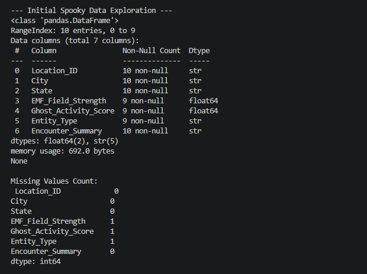
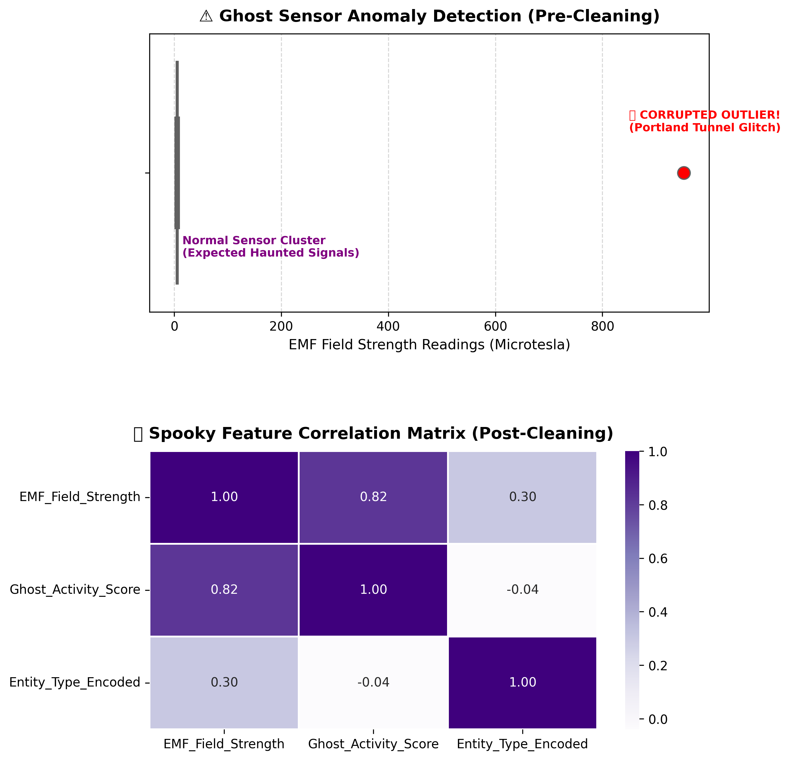
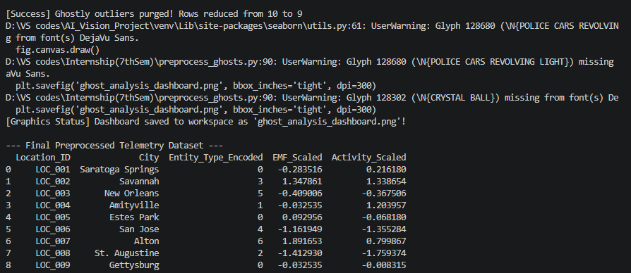

# 👻 Project GhostClean: Paranormal Telemetry Preprocessing

## 📖 The Story & Mission
Our field sensors deployed at famously haunted locations across the United States have transmitted back EMF readings and spectral activity metrics. However, due to "supernatural interference," our initial dataset arrived corrupted with missing metrics, tracking glitches, and unclassified entity types. 

Before we can train an accurate **Ghost Detection Machine Learning Model**, this data must undergo a rigorous preprocessing pipeline to ensure structural integrity.

---

## 🛠️ Preprocessing Pipeline Executed

The Python automation pipeline (`preprocess_ghosts.py`) executes the following operations systematically:

1. **Spectral Exploration:** Parsed the dataset structural limits using `df.info()`, identifying a total capacity of 10 initial entries and mapping out missing gaps.
2. **Imputing the Unknown:** Handled blank arrays (`NaN` cells) via statistical imputation to preserve valuable tracking entries:
   * **Median Imputation:** Patched the missing EMF continuous tracking gap for Amityville (`LOC_004`).
   * **Mean Imputation:** Calculated and restored the missing baseline activity score for Estes Park (`LOC_005`).
   * **Categorical Imputation:** Handled the unclassified label for Alton (`LOC_007`) with an isolated `'Unidentified Entity'` baseline.
3. **Purging Anomalies (Outlier Removal):** Detected an impossible EMF spike of `952.0` in the Portland underground tunnels using Seaborn boxplots. The script mathematically purged this row using the **Interquartile Range (IQR) Rule** to prevent skewed calculations.
4. **Spectral Class Encoding:** Converted text-based strings (`Entity_Type`) into clean sequential numerical markers (`0, 1, 2...`) using `LabelEncoder` so the computer can process them algebraically.
5. **Dimensional Feature Scaling:** Standardized the variances between different measurement ranges using `StandardScaler`, locking continuous features down to a uniform distribution centered around a mean ($\mu$) of $0$ and a standard deviation ($\sigma$) of $1$.

---

## 📂 Project Structure
Ensure your GitHub repository contains these exact elements:
* `haunted_telemetry.csv` — The raw initial data file.
* `preprocess_ghosts.py` — The updated automated preprocessing script.
* `ghost_analysis_dashboard.png` — Combined visual analytics layout saved by the code.
* `Output-1.png` — Screenshot of the initial data health analysis.
* `Output-2.png` — Screenshot of the final processed machine-ready table.

---

## 📊 Visual Dashboard & Execution Outputs

### 1. Initial Data Scan (Pre-Cleaning)
The parsing phase confirms that the raw inputs possess incomplete tracking frames, showing only 9 non-null values out of 10 entries across key features:

### 2. Comprehensive Analytics Dashboard
The pipeline automatically structures, styles, and saves a dual-chart dashboard block:
* **Top Half (Boxplot):** Identifies the Portland tracking anomaly sitting miles outside the valid upper whisker line, isolated in a warning red marker.
* **Bottom Half (Correlation Heatmap):** Plots the mathematical dependencies and linear correlations between our processed elements.

> **Note on Terminal Display:** Running the file on Windows environments generates a minor `UserWarning` indicating that standard system console fonts do not natively render the graphical title emojis (⚠️ and 🔮). This warning has zero functional impact—the high-resolution layout dashboard prints and saves completely intact!

### 3. Final Model-Ready Telemetry Matrix
Following outlier elimination and class transformation, the active matrix displays a perfectly scaled, fully numeric database structure ready for machine learning consumption:

